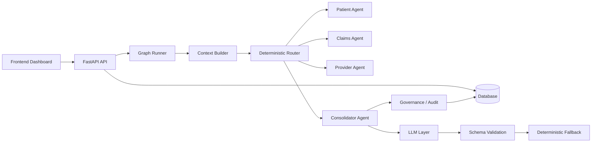

# AHIP

[](https://fastapi.tiangolo.com/)
[](https://react.dev/)
[](https://langchain-ai.github.io/langgraph/)
[](https://docs.docker.com/compose/)

AHIP is a deterministic healthcare operations intelligence platform enhanced with selective LLM capabilities inside a LangGraph-style workflow. It combines a FastAPI backend, a React dashboard, typed context packs, audit logging, and a controlled LLM-assisted Consolidator to produce explainable, human-reviewable recommendations.

AHIP is not a chatbot.
AHIP is not a medical diagnosis system.
AHIP is not a generic RAG application.

Instead, it is a deterministic healthcare operations intelligence platform enhanced with selective LLM capabilities inside a LangGraph workflow.

## Architecture Overview



| Layer | What it does |
|---|---|
| Frontend | React dashboard for operations, risk queue, claims, patients, providers, and case detail review |
| API | FastAPI routes for graph execution, dashboard summaries, governance, and entity listing |
| Database | SQLAlchemy-backed persistence with PostgreSQL in Docker and a local database default in development |
| Context Builder | Builds claim, patient journey, compliance, and relationship context packs |
| LangGraph | Deterministic routing and node orchestration via the stateless graph runner |
| Deterministic Agents | Patient, claims, and provider agents plus governance and risk processing |
| LLM Layer | Optional enhancement layer used only by the Consolidator Agent |
| Governance | Status updates, overrides, audit logs, execution history, and summary reporting |
| Docker | Compose configuration for PostgreSQL, backend, and frontend services |

## Project Summary

AHIP is designed for healthcare operations review and recommendation support. The system keeps routing, scoring, and governance deterministic, then lets the Consolidator Agent use an LLM only to improve the explanation layer.

The key idea is control:

- the workflow decision remains deterministic,
- the LLM only receives a safe context pack,
- the response must validate as structured JSON,
- invalid or failed LLM runs fall back to the deterministic path,
- metadata about the LLM run is retained in `llm_metadata` for auditability.

## Technology Stack

| Area | Stack |
|---|---|
| Backend | FastAPI, Python 3.12+, SQLAlchemy, Pydantic, Alembic |
| Frontend | React, React Router, Vite, TypeScript, Lucide React |
| Orchestration | Deterministic graph runner with route selection |
| LLM Integration | `backend/app/application/llm/` package, mock provider, optional hosted provider abstraction |
| Data | PostgreSQL via Docker Compose, local database configuration via `DATABASE_URL` |
| Delivery | Docker Compose and a published frontend demo |

## Features

- deterministic healthcare agents
- LangGraph orchestration
- conditional routing
- shared workflow memory
- context packs
- governance
- explainability
- audit trail
- recommendation engine
- LLM-assisted Consolidator Agent
- deterministic fallback
- structured JSON validation
- mock provider
- provider abstraction
- React dashboard
- workflow timeline
- evidence view
- risk queue

## System Workflow

1. The frontend triggers a case review from the dashboard or case detail view.
2. The API loads case data, context packs, and governance data from the database.
3. The graph runner selects a deterministic route based on the current state.
4. Patient, claims, provider, and governance nodes run in the selected order.
5. The Consolidator Agent produces a deterministic recommendation.
6. The LLM service optionally enriches the Consolidator narrative using a safe context pack.
7. The output is schema-validated and either accepted or replaced with a deterministic fallback.
8. The response returns the workflow output, route metadata, and `llm_metadata` for audit.

## Agent Architecture

The current backend includes these agentic pieces:

- Patient Journey Agent
- Claims Review Agent
- Provider Contract Agent
- Consolidator Agent
- Governance node
- Risk node
- Context node

The Consolidator is the only part of the workflow that is LLM-enhanced. All other routing and decision behavior remains deterministic.

## LangGraph Orchestration

The repository uses a stateless graph runner in `backend/app/application/graphs/graph_runner.py`. It initializes a `WorkflowState`, executes the context node, applies route selection, and then runs the selected node order.

Selected routes are deterministic:

- `standard`
- `high_value_claim`
- `provider_contract`
- `missing_data`

Route selection lives in `backend/app/application/graphs/router.py` and is driven by the context packs already attached to the workflow state.

### Route Behavior

| Route | Trigger | Typical node path |
|---|---|---|
| `standard` | Default route when no special condition is met | Full canonical sequence |
| `high_value_claim` | Claim amount meets the high-value threshold | Context, claims, risk, provider, consolidator, governance |
| `provider_contract` | Provider contract is missing or incomplete | Context, provider, claims, consolidator, risk, governance |
| `missing_data` | Required context is missing | Context, governance |

## LLM-Assisted Architecture

The LLM package lives in `backend/app/application/llm/` and is intentionally isolated from the rest of the workflow.

- `prompt_templates.py` builds the Consolidator prompt.
- `schemas.py` defines provider settings, structured output, and metadata.
- `provider_adapter.py` resolves the provider implementation.
- `mock_provider.py` returns deterministic JSON for demos and tests.
- `llm_service.py` builds safe context, calls the provider, validates output, and records metadata.
- `validators.py` checks the returned JSON and schema shape.

Only the Consolidator Agent receives LLM help, and even then only after the deterministic recommendation already exists.

### Guardrails

- safe context only includes the fields needed for explanation
- structured output is required
- schema validation must pass before the result is accepted
- deterministic fallback is used on any failure
- protected fields are not allowed to change
- audit metadata is attached as `llm_metadata`

### `llm_metadata`

The `/api/v1/agents/run-graph` response includes `llm_metadata` with fields such as:

- `enabled`
- `provider`
- `model`
- `validation`
- `fallback_used`
- `latency_ms`
- `provider_executed`
- `failure_reason`
- `validation_details`

## Governance

Governance is part of the product boundary, not an afterthought.

- recommendation status updates are supported through governance endpoints
- manual override capture is supported for authorized roles
- audit logs and execution history are available for review
- governance summary metrics are exposed to the frontend
- governance routes expect an `X-User-Role` header for access control checks

## Dashboard Overview

The React dashboard currently includes:

- executive summary metrics
- recommendation workload tracking
- high-risk queue preview
- governance summary metrics
- deterministic case review trigger
- risk queue filtering and prioritization
- case detail view
- shared workflow memory display
- agent output cards
- evidence view
- audit log table
- execution history timeline
- claims, patients, and providers list pages

The portfolio story file lives at [docs/AHIP_Learning_Story.html](docs/AHIP_Learning_Story.html).

## API Overview

### Core endpoints

| Method | Endpoint | Purpose |
|---|---|---|
| GET | `/api/v1/health` | Health check |
| GET | `/api/v1/dashboard/summary` | Executive dashboard summary |
| GET | `/api/v1/claims/` | Claims list |
| GET | `/api/v1/patients/` | Patients list |
| GET | `/api/v1/providers/` | Providers list |
| POST | `/api/v1/agents/run-case-review` | Existing deterministic case review workflow |
| POST | `/api/v1/agents/run-graph` | Stateless graph execution with route metadata and `llm_metadata` |
| GET | `/api/v1/agents/context/{case_id}` | Case context packs |
| GET | `/api/v1/agents/priority-queue` | Priority recommendation queue |
| POST | `/api/v1/agents/recommendations/status` | Update recommendation status |
| POST | `/api/v1/agents/recommendations/override` | Record a manual override |
| GET | `/api/v1/agents/audit-logs` | Governance audit log |
| GET | `/api/v1/agents/execution-history` | Agent execution history |
| GET | `/api/v1/agents/governance-summary` | Governance metrics |

### `/api/v1/agents/run-graph`

This endpoint is the clearest way to inspect the graph behavior.

It returns:

- graph mode and version
- workflow and case identifiers
- shared state
- execution trace
- recommendation output
- explanation output
- audit reference
- selected route metadata
- `llm_metadata`

The graph can run in deterministic mode without a provider, or in LLM-assisted mode when the provider is enabled and the output validates successfully.

## Deployment

### Live Demo

- Frontend: [https://ahip-eta.vercel.app/](https://ahip-eta.vercel.app/)
- Backend: [https://ahip.onrender.com](https://ahip.onrender.com)

### Docker

The repository includes `docker-compose.yml` with three services:

- PostgreSQL
- backend API
- frontend app

Run it with:

```bash
docker compose up --build
```

## Getting Started

### Environment Variables

The current codebase reads the following environment variables or documented examples:

| Variable | Purpose | Notes |
|---|---|---|
| `DATABASE_URL` | Database connection string | Used by the backend and Alembic |
| `LLM_ENABLED` | Enables the LLM layer | Defaults to `false` in `.env.example` |
| `LLM_PROVIDER` | Provider name | Defaults to `mock` |
| `LLM_MODEL` | Provider model name | Defaults to `mock-v1` |
| `LLM_API_KEY` | API key for hosted providers | Optional |
| `LLM_BASE_URL` | Example base URL setting | Documented in `.env.example`; not all providers use it |
| `LLM_TIMEOUT_SECONDS` | Provider timeout | Defaults to `20` |
| `LLM_MAX_TOKENS` | Token budget | Defaults to `500` |
| `VITE_API_BASE_URL` | Frontend API base URL | Optional; defaults to `http://localhost:8000/api/v1` |

### Running Locally

Backend:

```bash
cd backend
python -m venv venv
venv\Scripts\activate
pip install -r requirements.txt
uvicorn app.main:app --reload
```

Frontend:

```bash
cd frontend
npm install
npm run dev
```

Default local URLs:

- Frontend: `http://localhost:5173`
- Backend API: `http://localhost:8000/api/v1`
- Backend docs: `http://localhost:8000/docs`

## Repository Structure

```text
backend/
  app/
    api/v1/routes/
    application/
      agents/
      context/
      decision/
      governance/
      graphs/
        nodes/
      llm/
      services/
    domain/
      entities/
      schemas/
    infrastructure/
      database/
frontend/
  src/
    api/
    components/
    pages/
    types/
docs/
  AHIP_Learning_Story.html
```

## Screenshots

Placeholders only. Add screenshots here when they are ready.

| Screenshot | Status |
|---|---|
| Dashboard | Placeholder |
| Risk Queue | Placeholder |
| Case Detail | Placeholder |
| Graph Response | Placeholder |

## Known Limitations

- The project is still a portfolio-grade implementation, not a production healthcare system.
- Backend deployment is not publicly hosted in this repository snapshot.
- LLM support is intentionally constrained to the Consolidator narrative layer.
- Human review remains required for operational decisions.
- Authentication, tenant isolation, and production observability are not fully implemented.

## Future Improvements

- add a real hosted LLM provider configuration for production use
- add more automated tests around route selection and metadata handling
- expand governance analytics and audit exports
- harden authentication and authorization
- add screenshots and a more complete release checklist

## License

No LICENSE file is included in this repository snapshot. Add one before publishing the project externally.

## Acknowledgements

Built with FastAPI, React, SQLAlchemy, Pydantic, Vite, Docker, Lucide React, and a LangGraph-style orchestration pattern.

The portfolio presentation is available at [docs/AHIP_Learning_Story.html](docs/AHIP_Learning_Story.html).
